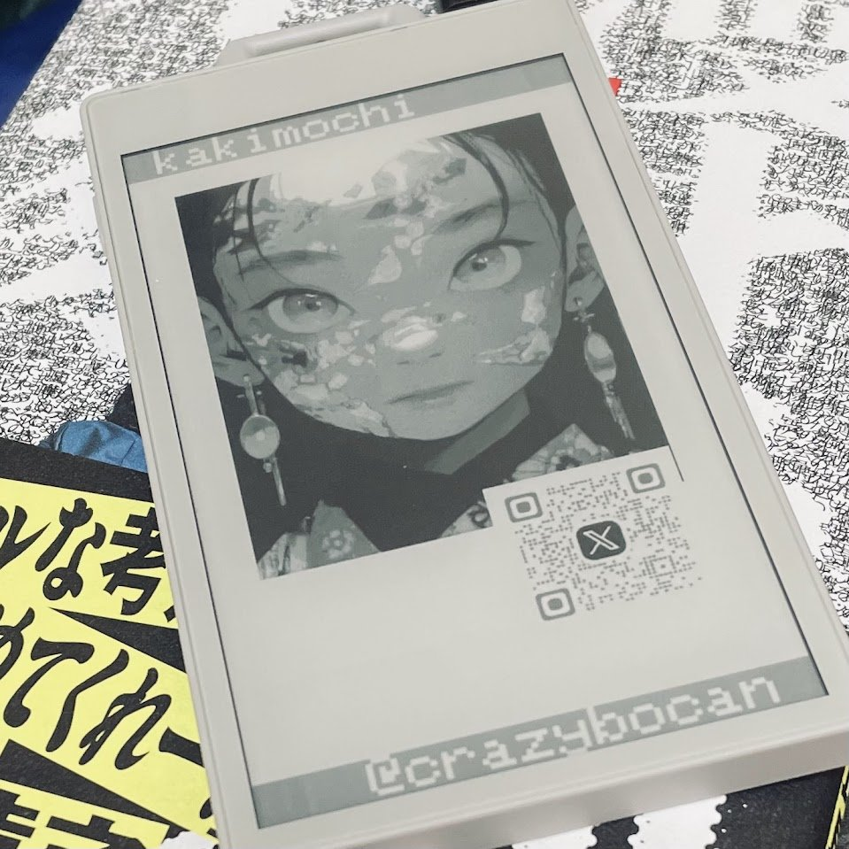

# M5PaperS3 NameCard

A digital business card display system for the M5Paper S3 e-paper device. This project creates an elegant, low-power digital name card that displays personal information, avatar image, and QR code on a 540x960 pixel e-paper display.

## Demo

**Project completion post**: [X (Twitter) - @crazybocan](https://x.com/crazybocan/status/1872445303632343306)

## Features

- Static name card display on e-paper screen
- Low power consumption ideal for conferences and networking events
- Customizable avatar and QR code images
- Professional digital alternative to traditional paper business cards
- Battery-powered operation

## Hardware Requirements

- **M5Paper S3** development board
- **Display**: 540 x 960 pixels, 16 gray levels
- **MicroSD card** for image storage
- **Development environment**: VSCode with PlatformIO extension

### Hardware Specifications

- **MicroSD SPI Configuration**:
  - CS: GPIO_NUM_47
  - SCK: GPIO_NUM_39
  - MISO: GPIO_NUM_40
  - MOSI: GPIO_NUM_38

## Image Preparation

### Avatar Image
- **Size**: 232 x 308 pixels
- **Format**: PNG, grayscale
- **Filename**: `kakimochi.png` (customize as needed)
- **Tools**: Use any image editor (e.g., IrfanView) to convert to grayscale

### QR Code Image
- **Format**: PNG, grayscale
- **Filename**: `kakimochi_x_qr.png` (customize as needed)
- **Generation**: Use online QR code generators like [https://qr.quel.jp/sns.php](https://qr.quel.jp/sns.php)
- **Processing**: Convert to grayscale using image editing software

## Setup Instructions

### 1. Development Environment
- Install **VSCode**
- Install **PlatformIO** extension for VSCode

### 2. MicroSD Card Setup
Place the following files in the **root directory** of your microSD card:
- `/kakimochi.png` (your avatar image)
- `/kakimochi_x_qr.png` (your QR code image)

### 3. Code Deployment
1. Clone this repository
2. Open the project in VSCode with PlatformIO
3. Connect your M5Paper S3 device
4. Build and upload the firmware

## Usage

1. Insert the prepared microSD card into the M5Paper S3
2. Power on the device
3. The name card will be displayed automatically on the e-paper screen
4. The display will remain static, consuming minimal power

## Code Structure

The main application logic is contained in `src/main.cpp`:
- Hardware initialization (M5 stack, power management, SD card, display)
- Image loading and rendering from SD card
- Static display composition with text and graphics
- Setup-once, display-forever pattern optimized for e-paper

## Dependencies

- **M5Unified** (v0.2.2+): M5Stack hardware support library
- **epdiy**: E-paper display driver library
- **Arduino Framework**: ESP32-S3 development framework

## References

- [M5Paper S3 Official Documentation](https://docs.m5stack.com/en/core/papers3)
- [M5GFX Library Documentation](https://github.com/m5stack/M5GFX/blob/master/docs/M5PaperS3.md)
- [M5Stack SD Card Guide](https://docs.m5stack.com/ja/arduino/m5cores3/sdcard)
- [Original Zenn Article (Japanese)](https://zenn.dev/kakimochi/scraps/d3c96ab1d5c8ec)

## License

This project is open source. Please refer to the license file for details.

## Contributing

Contributions are welcome! Please feel free to submit issues and pull requests.
